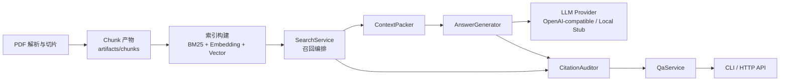

# API 与召回开发说明

## 相关文档

- 开发计划：[`development_plan.md`](development_plan.md)
- Chunk 异常巡检报告：[`../analysis/chunk_anomaly_report.md`](../analysis/chunk_anomaly_report.md)
- 项目整体待优化文档：[`../analysis/project_optimization_backlog.md`](../analysis/project_optimization_backlog.md)
- 当前最小化 RAG 实现缺口分析：[`../analysis/current_rag_gap_analysis.md`](../analysis/current_rag_gap_analysis.md)

## 1. 当前 API 调用方式、示例与调用链路

### 1.1 环境变量

项目根目录下的 `.env` 当前支持以下配置：

```env
DASHSCOPE_API_KEY=your_api_key
DASHSCOPE_BASE_URL=your_openai_compatible_base_url
DASHSCOPE_MODEL=qwen-plus
```

这些配置由 `src/config/settings.py` 自动加载。

当前与生成相关的核心配置包括：

- `LLM_PROVIDER`
- `LLM_PROMPT_FAMILY`
- `DASHSCOPE_API_KEY`
- `DASHSCOPE_BASE_URL`
- `DASHSCOPE_MODEL`

### 1.2 HTTP API

当前问答接口：

- `POST /api/qa/ask`

请求示例：

```json
{
  "query": "Sora 2 有什么升级？",
  "top_k": 4,
  "tables_only": false
}
```

返回示例结构：

```json
{
  "query": "Sora 2 有什么升级？",
  "answer": "......",
  "confidence": "medium",
  "model": "qwen-plus",
  "embedding_backend": "sentence_transformer",
  "retrieved_count": 4,
  "citations": [
    {
      "claim": "......",
      "doc_id": "doc_xxx",
      "page_no": 5,
      "chunk_id": "doc_xxx_p5_c12",
      "excerpt": "......"
    }
  ],
  "evidence": [
    {
      "chunk_id": "doc_xxx_p5_c12",
      "doc_id": "doc_xxx",
      "page_no": 5,
      "chunk_type": "paragraph",
      "section_path": ["..."],
      "score": 0.03,
      "sources": ["bm25", "vector"],
      "text": "......"
    }
  ]
}
```

### 1.3 命令行调用方式

直接通过命令行提问：

```powershell
chcp 65001
.\scripts\ask.ps1 -Query "Sora 2 有什么升级？" -TopK 4
```

启动本地 API：

```powershell
.\scripts\start_api.ps1 -Port 8000
```

执行本地 HTTP smoke test：

```powershell
.\scripts\smoke_test_api.ps1 -BaseUrl "http://127.0.0.1:8000" -Query "Sora 2 有什么升级？"
```

### 1.4 当前调用链路

当前 HTTP 调用链路如下：

1. `src/api/routes/qa.py` 接收请求。
2. `src/generation/qa_service.py` 负责编排召回与生成。
3. `src/retrieval/search_service.py` 执行：
   - BM25 召回
   - 向量召回
   - hybrid fusion
   - filter
   - dedup
   - collapse
4. `src/retrieval/context_packer.py` 选择证据上下文。
5. `src/generation/answer_generator.py` 构造 prompt 并调用模型。
6. `src/generation/factory.py` 创建 LLM provider。
7. `src/generation/prompts/factory.py` 选择 prompt family。
8. `src/generation/providers/openai_compatible.py` 通过 `openai` 包以 OpenAI 兼容方式调用 DashScope。
9. `src/generation/citation_auditor.py` 做基础引用校验。

### 1.5 Prompt Family

当前 prompt 已经从 `AnswerGenerator` 中抽离，放到 `src/generation/prompts` 下统一管理。

目前支持：

- `auto`
  - 自动根据模型名选择 prompt family
- `zh_generic`
  - 通用中文问答模板
- `qwen`
  - 针对 Qwen 风格单独准备的中文模板

当前建议：

- 如果模型主要是 Qwen 系列，优先使用 `qwen`
- 如果后续接其他中文模型，先用 `zh_generic`
- 如果希望配置最少，可以保留 `auto`

### 1.6 当前检索加载路径

当前检索层的优先加载顺序：

1. 优先读取持久化索引 `indexes/retrieval_cache/bge_base_zh_v1_5`
2. 如果没有索引，则回退到 `artifacts/chunks`

当前 embedding 模型可通过 `LOCAL_EMBEDDING_MODEL_DIR` 配置。

### 1.7 当前模块关系图



### 1.8 当前分层职责

当前系统可以粗分为五层：

1. Ingestion 层
- 负责 PDF 解析、清洗、section 构建、chunk 生成
- 产出 `artifacts/parsed` 与 `artifacts/chunks`

2. Indexing 层
- 负责构建 BM25、embedding、向量索引以及持久化索引
- 当前 embedding 支持通过环境变量指向本地模型

3. Retrieval 层
- 负责召回、融合、过滤、去重与局部聚合
- 当前核心类是 `SearchService`

4. Generation 层
- 负责上下文拼装、LLM 调用、答案生成与基础引用校验
- 当前核心类是 `QaService`

5. Interface 层
- 对外提供命令行与 HTTP 能力
- 当前包括 `scripts/*.ps1`、`src/generation/cli.py`、`src/api/routes/qa.py`

---

## 2. 之前召回存在的问题与优化记录

### 2.1 初始阶段存在的主要问题

早期召回问题主要集中在以下几类：

- 同一页、同一 section 下的多个 chunk 重复进入 top-k
- heading、paragraph、table 同时上榜，造成局部重复严重
- `tables-only` 查询经常返回 0 个结果
- 目录页、图表目录页会污染前排结果
- 图表页中的坐标轴、短数字、图例文本会被当作有效证据
- 模型生成本身没有问题，但输入证据质量不稳定

典型现象包括：

- 查询 `Sora 2` 时，结果里混入目录页、图表目录页、短数字页和重复标题
- 查询 `比亚迪 销量` 时，早期几乎拿不到有效表格结果
- 查询 `比亚迪2025年营收如何` 时，命中的往往是销量图、市占率图、终端销量走势，而不是更接近营收的证据

### 2.2 已完成的优化记录

目前已经完成的优化包括：

1. 混合召回基础能力
- 增加 BM25
- 增加向量召回
- 增加 hybrid fusion

2. 结果去重
- 去掉完全重复文本
- 去掉被同 scope 正文覆盖的短 heading

3. 结果聚合
- 按 `doc_id + page_no + section_path` 做 collapse
- 每个局部区域只保留一个代表 chunk

4. 导航页降权
- 对 `目录`、`图表目录`、`contents` 等导航型 chunk 做降权

5. 检索层重构
- 将排序相关逻辑从 `SearchService` 中拆出
- 新增 `src/retrieval/signals.py` 作为通用信号层

6. 通用排序信号
- query phrase overlap
- query token overlap
- 时间表达式对齐
- navigational chunk penalty
- sparse chunk penalty
- narrative chunk bonus
- structured-query preference

### 2.3 当前效果判断

目前召回质量相较最初版本已有明显改善：

- `Sora 2` 不再被目录页和重复标题严重污染
- 表格召回已经从“基本不可用”进入“可以返回有效结果”
- CLI 问答链路和 HTTP API 问答链路都已经能端到端跑通

但当前仍然存在明显短板：

- 图表证据仍然偏“弱结构化”
- 财务、指标、时间类问题仍容易受到图表碎片干扰
- 复杂 PDF 中的高价值信息很多还只是文本碎片，并未被结构化建模

### 2.4 当前优化的阶段性结论

目前可以明确下来的阶段性结论有三点：

1. 检索问题并不只是 embedding 问题
- 即便换成了更强的 embedding，证据质量差时仍会召回到不适合作答的 chunk
- 因此问题核心仍然是 chunk 质量、版面理解和证据表示方式

2. `SearchService` 适合做通用排序修正，不适合承载领域知识
- retrieval core 可以做通用 signal
- 但不应该逐步演变成“业务规则堆栈”

3. 当前系统已经具备验证后续优化的基础设施
- CLI 可直接验召回结果
- API 可端到端验证问答输出
- 持久化索引可重复对比优化前后效果

---

## 3. 开发边界问题

### 3.1 SearchService 应该做什么

`SearchService` 当前应当被定义为“检索编排器”，而不是“领域语义解释器”。

它应该负责：

- BM25 召回
- 向量召回
- hybrid fusion
- 基础 filter
- dedup
- collapse
- 调用通用排序信号

### 3.2 SearchService 不应该做什么

`SearchService` 不应该直接包含：

- 行业词典
- 财务指标映射
- 公司别名逻辑
- 业务模板特判
- 垂直领域的正负关键词规则

例如下面这类逻辑，不应该继续留在 retrieval core 中：

- `营收 -> 营业收入 -> revenue`
- `营收` 与 `销量` 的硬编码对立关系
- 针对某个行业、某类报告、某家公司单独写的语义规则

### 3.3 当前边界划分

当前边界已经比之前更清楚：

- `src/retrieval/search_service.py`
  - 只负责检索编排
- `src/retrieval/signals.py`
  - 只负责通用检索信号
- 更强的领域语义
  - 后续应上移到 profile 层
- 更强的语义排序
  - 后续应放到 reranker 层

### 3.4 当前推荐的边界判断原则

如果一个优化依赖的是：

- query 的词面形式
- 页面布局的一般特征
- chunk 的文本密度
- 是否像导航页、是否像稀疏块、是否像叙述块

那么它属于 retrieval core，可以保留在通用检索层。

如果一个优化依赖的是：

- 某个行业的指标体系
- 某类公司、某类报告的特定语义
- 某个领域的业务词典
- 特定问题模板下的业务判断

那么它应该移动到：

- domain profile
- structured extraction
- reranker
- query planning

### 3.5 未来建议的分层边界

后续推荐按下面的边界继续演进：

1. Retrieval Core
- 只做通用召回与通用排序
- 只依赖 query 词面特征、chunk 结构特征、页面通用模式

2. Reranker
- 负责更强的相关性判断
- 可以逐步承接更复杂的语义排序

3. Structured Extraction
- 负责把表格、图表、半结构化页面转成更适合检索和问答的对象

4. Domain Profile
- 负责行业词典、指标体系、实体别名、垂直语义扩展
- 必须与 retrieval core 解耦

5. Query Planning
- 负责识别问题类型
- 决定调用哪条证据链路
- 决定偏向正文、表格还是结构化记录

### 3.6 为什么当前要坚持这个边界

当前阶段坚持边界的原因主要有：

- 避免 SearchService 越来越难维护
- 避免一次临时优化污染整体架构
- 保证通用 PDF 底座可以服务多个领域
- 为后续 finance profile、legal profile 等扩展预留清晰入口

---

## 4. 后续优化方向

### 4.1 短期方向

1. 增强通用检索信号
- 继续优化 sparse block 检测
- 继续优化 narrative block 检测
- 提升 section/path 感知能力

2. 引入轻量 reranker
- 在 hybrid retrieval 之后加入更强的排序层
- 让 retrieval core 保持通用，而将更细粒度的语义判断放到 reranker

3. 增强证据多样性
- 避免 top-k 过度集中在同一页、同一局部区域
- 在必要时加入文档/页级别的多样性控制

### 4.2 中期方向

1. 做 parent-child chunking
- 用 child chunk 做召回
- 用 parent chunk 做回答
- 保留细粒度引用，同时给生成更完整上下文

2. 做表格 / 图表的半结构化抽取
- 抽取标题、单位、时间轴、维度信息
- 从“只有原始文本”升级到“半结构化记录”

3. 更好的版面理解
- 页面分区
- 阅读顺序重建
- 显式区分正文区、侧栏区、图表区、页眉页脚区

### 4.3 长期方向

1. 引入 domain profile
- finance profile
- legal profile
- research profile

这些能力应当作为可配置扩展层存在，而不是写死在 retrieval core 里。

2. 引入 query planning
- 识别问题类型
- 判断应该优先正文、表格还是结构化数据
- 根据问题类型调整检索路径

3. 更强的 citation 对齐
- claim 级引用映射
- 句级或 claim 级证据归因

### 4.4 推荐推进顺序

建议后续按以下顺序继续推进：

1. 引入轻量 reranker
2. 实现 parent-child chunking
3. 实现表格 / 图表半结构化抽取
4. 增强页面分区与布局理解
5. 引入 domain profile

### 4.5 每个方向解决什么问题

1. 轻量 reranker
- 解决“召回到了，但排序不够准”

2. Parent-child chunking
- 解决“小 chunk 检索准、大 chunk 回答全”的矛盾

3. 表格 / 图表半结构化抽取
- 解决“信息在图表里，但现在只是碎文本，机器很难稳定利用”

4. 页面分区与布局理解
- 解决“复杂版面下，侧栏、图表、封面、装饰信息混入正文”的问题

5. Domain profile
- 解决“不同领域对实体、指标、术语理解差异大”的问题

### 4.6 推荐的近期落地项

如果按当前项目状态，我建议近期优先落地：

1. 轻量 reranker
2. parent-child chunking 设计与第一版实现
3. 图表 / 表格区域的半结构化元数据抽取

原因是这三项能直接改善当前最明显的证据质量问题，同时又不会破坏现有 API 与检索主链路。

---

## 5. 当前总结

目前系统已经具备：

- 本地索引检索
- OpenAI 兼容 LLM 调用
- CLI 问答
- HTTP API 问答
- evidence 和 citation 返回

当前主要瓶颈已经不是 API 连接能力，而是证据质量：

- chunk 粒度仍不够理想
- 图表 / 表格信息仍偏弱结构化
- retrieval core 应继续保持通用
- 更高阶的语义精度应逐步迁移到 reranker、结构化抽取和 domain profile 层
