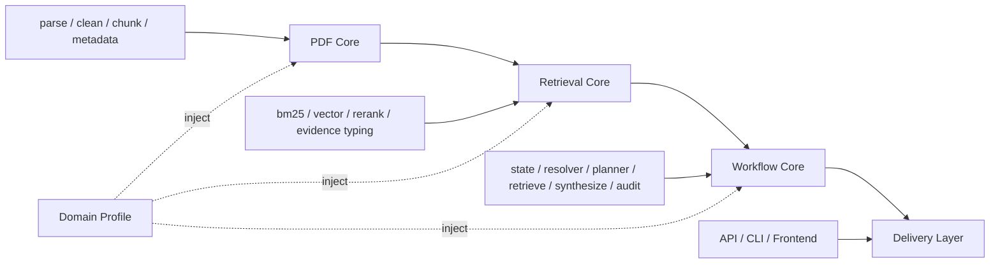

# 最小重构与设计演进方案

## 1. 目的

本文档基于以下两份文档交叉整理：

- `docs/generic_pdf_agentic_rag_design.md`
- `docs/analysis/current_implementation_review.md`

目标不是推倒当前实现重做，而是回答一个更现实的问题：

> 在保留当前可运行主链的前提下，如何做最小重构，并逐步朝最初设计方向演进？

这里的关键词是：

- 最小重构
- 渐进演进
- 保持当前主链可运行
- 优先收敛边界，而不是先换框架

---

## 2. 当前问题的本质

对照最初设计和当前实现审查，当前项目的主要问题不是方向错误，而是：

1. 主链已经可运行，但分层边界还不够清晰
2. 一些能力已经写入 state / session / metadata，但还没有被后续流程真正消费
3. 存在重复实现和名义抽象
4. 一些设计里强调的关键能力还没有进入真实主流程

一句话概括：

**当前项目已经完成了“最小可运行闭环”，但距离“清晰分层、可持续扩展的 Agentic PDF RAG 系统”还有一步收边界的工作。**

---

## 3. 演进原则

后续重构建议遵循以下原则：

### 3.1 先收敛，不推倒

优先收拢已有实现的边界与契约，而不是大规模替换现有主链。

### 3.2 先统一状态和契约，再扩能力

多轮、失败路径、planner/retrieval/auditor 契约，是后续演进的核心地基。

### 3.3 先把现有结构做实，再考虑更重框架

当前自研 workflow 并不是问题。  
问题在于：

- 它的边界还不够收紧
- 上下文与 profile 还没真正接入

因此不建议现在优先切 LangGraph 或 MCP。

### 3.4 以“可持续扩展”为目标，而不是“功能继续铺开”

当前最值得做的，不是增加更多入口、按钮或路由分支，而是让已有能力真正形成稳定主链。

---

## 4. 目标形态

建议把当前系统收敛成如下形态：

这里的关键点是：

- `PDF Core` 负责文档与证据准备
- `Retrieval Core` 负责证据召回与排序
- `Workflow Core` 负责状态推进与任务编排
- `Delivery Layer` 只做对外适配
- `Domain Profile` 作为横切能力注入，而不是硬编码在主链里

---

## 5. 最小重构方案

## 5.1 Phase A：先收 Workflow Core

这是最优先的重构方向。

当前 workflow 已经存在：

- `ResearchState`
- `Router`
- `QueryWorkflow`
- `ConversationResolverNode`
- `QueryPlannerNode`
- `RetrievalStrategistNode`
- `SynthesizerNode`
- `CitationAuditorNode`

但还存在这些问题：

- `SupervisorNode` 价值过弱
- 节点契约虽已开始统一，但还没有完全成为唯一主通信方式
- 部分节点保留 placeholder 分支，容易掩盖 wiring 问题

### 建议动作

1. 继续收紧 `ResearchState` 和结果契约
2. 明确 `request_options / planner_result / retrieval_result / audit_result / failure_info` 是唯一主流程契约
3. 评估 `SupervisorNode` 去留
4. 生产入口尽量 fail-fast，减少 placeholder 静默补假数据

### 预期收益

- agentic workflow 真正成为“稳定核心”
- 状态与节点边界更清楚
- 失败/降级路径更可信

---

## 5.2 Phase B：收 Service Layer

当前 `QaService` 和 `AgenticQaService` 已经出现重复逻辑：

- citation 构造
- evidence 序列化
- response 拼装

这属于典型的“短期能跑，长期会漂移”的问题。

### 建议动作

抽离公共响应层，例如：

- `src/generation/response_builder.py`

统一负责：

- `_build_citations`
- `_serialize_evidence`
- `response payload assembly`

### 预期收益

- 减少普通 QA 和 agentic QA 的实现漂移
- 后续 API / 前端字段调整只改一处

---

## 5.3 Phase C：把多轮从“有状态”升级为“真消费”

这是当前最值得推进、也最符合最初设计方向的一步。

目前已经有：

- `session_id`
- `messages`
- `conversation_summary`
- `current_entities`
- `ConversationResolverNode`
- `FileThreadStore`

但这些信息还没有真正进入：

- planner
- retrieval
- synthesis

### 建议动作

1. 修复 `ConversationResolverNode` 的编码污染和规则可靠性
2. 让 `QueryPlannerNode` 显式读取：
   - `resolved_user_query`
   - `conversation_summary`
   - 最近若干轮 `messages`
   - `current_entities`
3. 让 planner 输出：
   - `entity_scope`
   - `time_scope`
   - `carry_over_constraints`
4. 让 `RetrievalStrategistNode` 消费这些上下文约束

### 预期收益

当前多轮会从：

- “session-aware single-turn QA”

推进到：

- “context-aware planning and retrieval”

这一步会非常接近最初设计里“thread state + follow-up continuity”的目标。

---

## 5.4 Phase D：让 Domain Profile 成为真实扩展点

在最初设计里，`Domain Profile` 是非常关键的一层：

- metadata enrich
- entity extract
- query expand
- filter build
- prompt context

但当前它更多还停留在“概念和目录存在”，没有真正进入主链。

### 建议动作

先不要做很多 profile，而是先做实：

- `GenericProfile`
- `FinanceProfile`

并让以下环节支持 profile 注入：

1. planner
2. retrieval
3. generation
4. metadata enrich

### 预期收益

- 后续领域扩展不会继续污染主链
- 更贴近最初“PDF Core + Agent Runtime + Domain Profile”的设计结构

---

## 5.5 Phase E：最后再推进 PDF Core 的结构升级

从质量角度看，复杂 PDF 的真正瓶颈仍然在页面结构理解层：

- page profile
- zone
- content role
- dense label region
- chart/table caption handling

但从最小重构角度，这不应该是第一步，因为一旦全面修改 parser，会牵动过大。

### 建议动作

采用“最小插入式”演进：

1. 先把 `page_profile / zone / content_role` 作为一等元数据写稳
2. 让 chunker 和 retrieval 消费这些字段
3. 再逐步增强 page zoning / chart-heavy page 处理

### 预期收益

- 改善 chunk 质量
- 改善 evidence 质量
- 提高 retrieval 和 citation 的可信度

---

## 6. 当前不建议优先做的事

为了保持“最小重构”，以下事情当前不建议排到最前：

### 6.1 不建议现在优先切 LangGraph

当前自研 workflow 仍然够用。  
问题不在有没有框架，而在：

- 现有 workflow 边界还没完全收紧
- 上下文和 profile 还没真正接进来

### 6.2 不建议现在优先做 MCP 化

MCP 是最初设计的第四层，但当前主链尚未完全收口。  
过早 MCP 化会放大复杂度，而不是解决核心问题。

### 6.3 不建议继续优先扩前端

前端当前已经足够承载：

- 标准 QA
- agentic QA
- route trace
- 多轮 session 展示

现在的瓶颈不在展示，而在主链收敛。

### 6.4 不建议先做很多 profile

比起增加 profile 数量，更重要的是先让 `generic / finance` 真正进入主流程。

---

## 7. 推荐推进顺序

推荐按下面顺序推进：

1. 修复 `ConversationResolverNode` 编码污染和规则可靠性
2. 处理 `SupervisorNode` 去留
3. 抽离 `response_builder`，收掉 `QaService / AgenticQaService` 重复逻辑
4. 让 `QueryPlannerNode` 真正消费会话状态
5. 让 `RetrievalStrategistNode` 消费 planner 产出的上下文约束
6. 让 `GenericProfile` 成为真实注入点
7. 把 `page_profile / zone / content_role` 继续接进主链

---

## 8. 结论

如果目标是：

> 在不推倒当前实现的前提下，逐步朝最初设计演进

那么最合理的最小重构路线不是“大换架构”，而是：

**先收 Workflow Core，再把会话上下文、Profile 注入和页面结构信号逐步接进来。**

这样做的好处是：

- 保留当前可运行主链
- 不破坏现有 API / CLI / Frontend / agentic 路径
- 每一步都能独立验证收益
- 后续若要迁移到更重的图编排框架或 MCP，也会更顺

一句话总结：

**当前最需要的不是更多功能，而是让已有能力真正形成清晰、稳定、可扩展的主链。**
